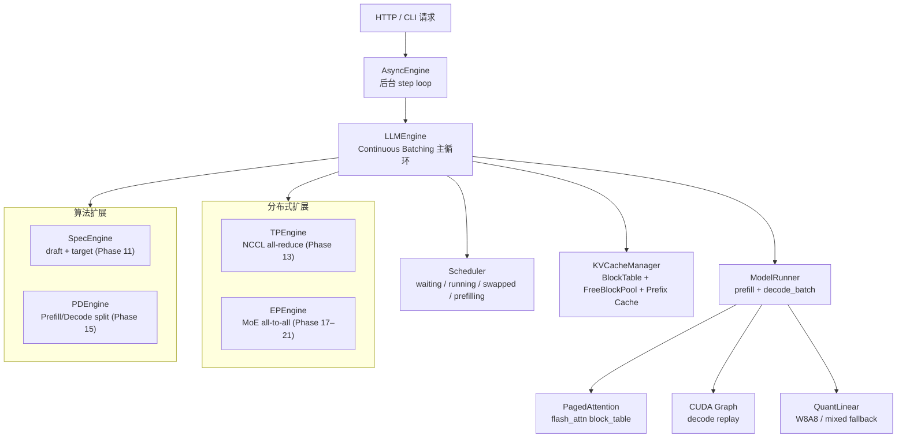

# mini-infer

> 面向 decoder-only 模型的学习型推理引擎，从零实现并验证了 21 个关键推理系统机制：Paged KV Cache、Continuous Batching、PagedAttention、Chunked Prefill、Prefix Caching、Speculative Decoding、CUDA Graph、Flash Decoding、Tensor Parallelism、MLA、MoE Expert Parallelism。每个机制都有独立的 benchmark 数据和验收口径。


---

## 核心成果

| 技术 | 关键数据 |
|------|---------|
| **True PagedAttention**（flash_attn block_table） | batch=8 吞吐达到 HF Transformers **100%**（406 tok/s） |
| **Chunked Prefill** | ITL spike 降低 **57%–67%** |
| **Prefix Caching**（block-level hash + LRU） | 共享前缀 TTFT **−22%** |
| **Speculative Decoding**（0.5B draft + 7B target） | acceptance rate **55.85%** |
| **CUDA Graph**（decode_batch 静态捕获） | 1.5B bs=1 decode 延迟 **−28.9%** |
| **Flash Decoding**（Triton split-K） | seq=4096 延迟 **3.31×** vs 标准 Triton，SM 利用率 9%→103% |
| **Tensor Parallelism**（NCCL all-reduce，Megatron-LM 风格） | TP=2 greedy 输出与单卡**完全一致**（见注 ¹） |
| **MLA**（DeepSeek-V2/V3 架构） | latent cache 体积 **−56.25%** vs GQA |
| **W8A8 量化**（per-channel int8 + mixed fallback） | 权重显存 **−32.4%**，greedy match 71.8%（见注 ²） |
| **MoE Expert Parallelism**（Grouped Local Execution） | EP grouped / dense = **2.500×** |

完整 benchmark 数据与复现命令见 [docs/benchmarks.md](docs/benchmarks.md)。

| 主线吞吐演进 | MoE EP 吞吐演进 |
|:-----------:|:--------------:|
|  |  |

| Flash Decoding（seq_len sweep） | CUDA Graph decode 延迟 |
|:-------------------------------:|:---------------------:|
|  |  |

> ¹ **TP 说明**：1.5B 模型规模下，2 卡 NCCL all-reduce 通信开销超过计算节省，吞吐未提升；当前验收结论为 greedy 输出与单卡完全一致（正确性已验证）。TP 适用场景是单卡显存不足时的大模型横向扩展，而非 1.5B 这类规模的提速。
>
> ² **W8A8 说明**：decode 路径当前受限于 `torch._int_mm` 小 M 路径瓶颈，退回 FP16 mixed fallback（显存节省有效，decode 速度无明显提升）。greedy match 71.8% 属于 correctness-first 实现，未做 PTQ/AWQ 校准；权重显存收益 −32.4% 已确认。

---

## 快速开始

### 安装

```bash
git clone https://github.com/psmarter/mini-infer
cd mini-infer
pip install -e ".[serve]"        # 基础依赖 + HTTP serving
pip install -e ".[serve,dev]"    # 含测试工具
pip install -e ".[all]"          # 安装全部可选依赖
```

如需 True PagedAttention（flash_attn block_table）路径：

```bash
pip install "flash-attn>=2.5.0" --no-build-isolation
```

安装后可直接使用 CLI 命令：`mini-infer-serve` / `mini-infer-chat` / `mini-infer-demo`

---

## 先跑一个最小可用演示

### 方式 A — 无需模型权重，30 秒验证

```bash
python serve.py --dry-run --port 8000   # 或：mini-infer-serve --dry-run --port 8000
python quick_chat.py
```

### 方式 B — 功能对比演示（需要 Qwen2.5-1.5B，约 3 GB VRAM）

```bash
export MODEL=/path/to/Qwen2.5-1.5B-Instruct && export HF_HUB_OFFLINE=1

python demo.py --model $MODEL --mode quant         # FP16 vs W8A8：显存 + 文本质量
python demo.py --model $MODEL --mode cuda-graph    # Eager vs CUDA Graph：decode 延迟
python demo.py --model $MODEL --mode prefix-cache  # 冷启动 vs 前缀命中：TTFT
python demo.py --model $MODEL --mode all
```

### 方式 C — 主线 benchmark（需要 Qwen2.5-7B-Instruct）

```bash
export MODEL=/path/to/Qwen2.5-7B-Instruct && export HF_HUB_OFFLINE=1
python benchmarks/benchmark_flash.py --model $MODEL --batch-size 8 --compare
```

---

## 架构总览



详细模块说明见 [docs/architecture.md](docs/architecture.md)。

---

## 当前实现路线

**Runtime 基础** — Paged KV Cache、Continuous Batching、Scheduler（四队列）、Preemption

**性能优化** — True PagedAttention（100% HF baseline）、Chunked Prefill（ITL −57%）、Prefix Caching（TTFT −22%）、Speculative Decoding（acceptance 55.85%）、CUDA Graph（延迟 −28.9%）、Flash Decoding（3.31×）

**扩展能力** — HTTP serving（OpenAI 兼容）、Tensor Parallelism（NCCL）、MLA（DeepSeek-V2/V3）、PD 解耦、W8A8 量化（显存 −32.4%）、MoE EP Grouped Execution（2.500×）

<details>
<summary>展开完整 21 阶段列表</summary>

| 阶段 | 内容 | 状态 |
|------|------|------|
| Phase 1 | 单卡最小推理链路 | ✅ |
| Phase 2 | Paged KV Cache + Prefill/Decode 分离 + Continuous Batching | ✅ |
| Phase 3 | gather_batch_kv 向量化 + DynamicCache（batch=8 吞吐 88.4% HF） | ✅ |
| Phase 4 | 双卡扩展（Replica + HF Pipeline Parallel） | ✅ |
| Phase 5 | Profiling + 技术总结 | ✅ |
| Phase 6 | True PagedAttention（flash_attn block_table，100% HF） | ✅ |
| Phase 6.5 | Triton decode attention kernel | ✅ |
| Phase 7 | Preemption + Priority Scheduling | ✅ |
| Phase 8 | OpenAI Chat Completions 兼容 HTTP API | ✅ |
| Phase 9 | Chunked Prefill（ITL spike −57%） | ✅ |
| Phase 10 | Prefix Caching（TTFT −22%） | ✅ |
| Phase 11 | Speculative Decoding（acceptance_rate 55.85%） | ✅ |
| Phase 12 | CUDA Graph（decode 延迟 −28.9%） | ✅ |
| Phase 12.5 | Flash Decoding（3.31× vs triton_65） | ✅ |
| Phase 13 | Tensor Parallelism（NCCL，Megatron-LM 风格） | ✅ |
| Phase 14 | MLA（DeepSeek-V2/V3，latent cache −56.25%） | ✅ |
| Phase 15 | PD 解耦（同机双进程，KV 传输） | ✅ |
| Phase 16 | W8A8 量化（权重显存 −32.4%） | ✅ |
| Phase 17 | MoE + Expert Parallelism（1.891×） | ✅ |
| Phase 18 | True Expert Sharding（shard_ratio 0.5002） | ✅ |
| Phase 19 | Non-Padded EP Dispatch（2.323×） | ✅ |
| Phase 20 | EP Control Plane 收敛（2.310×） | ✅ |
| Phase 21 | Grouped Expert Execution（2.500×） | ✅ |

详细阶段说明见 [docs/phases.md](docs/phases.md)。

</details>

---

## 服务化能力

`mini-infer` 提供 OpenAI Chat Completions 子集兼容接口：

- `GET /v1/models`
- `POST /v1/chat/completions`（streaming + non-streaming）
- 通过 `AsyncEngine` 实现后台 step loop
- 多并发请求自动合并进同一 decode batch

**启动服务：**

```bash
mini-infer-serve --dry-run --port 8000                           # 无需模型权重
mini-infer-serve --model /path/to/model --port 8000              # 真实模型
mini-infer-serve --model /path/to/model --chunk-prefill-size 256 # 开启 Chunked Prefill
```

**curl 快速验证：**

```bash
curl http://localhost:8000/v1/chat/completions \
  -H "Content-Type: application/json" \
  -d '{"model":"mini-infer","messages":[{"role":"user","content":"Hello"}],"stream":false}'
```

Python 完整示例（non-streaming / streaming / 多轮对话）见 [`examples/openai_client.py`](examples/openai_client.py)。

---

## 推荐阅读路径

- **了解核心调度器**：`runtime/scheduler.py`（四队列 + chunked prefill 状态机）
- **了解 KV cache**：`cache/kv_cache.py`（BlockTable + FreeBlockPool + Prefix Cache hash）
- **看 attention 内核**：`kernels/attention.py` → `kernels/triton_attn.py` → `kernels/triton_flash_decode.py`
- **看模型执行层**：`modeling/model_runner.py`（prefill + decode + CUDA Graph 静态捕获）
- **看分布式扩展**：`parallel/tp_engine.py`（Megatron-LM 风格 TP）/ `parallel/ep_engine.py`（MoE EP grouped execution）

---

## 目录结构

```text
mini-infer/
├─ mini_infer/
│  ├─ core/            # EngineConfig、Request、SamplingParams
│  ├─ runtime/         # LLMEngine、Scheduler、AsyncEngine、SpecEngine、PDEngine
│  ├─ cache/           # KVCacheManager（BlockTable + Prefix Cache）、KV 传输
│  ├─ modeling/        # ModelRunner、量化、MLA、MoE
│  ├─ kernels/         # PagedAttention、Triton decode、Flash Decoding
│  ├─ parallel/        # TP、EP、Replica、PP
│  ├─ serving/         # FastAPI server、OpenAI schema
│  ├─ clients/         # 交互式聊天客户端
│  └─ cli/             # console scripts（mini-infer-serve/chat/demo）
├─ benchmarks/         # 每个 phase 对应一个 benchmark 脚本（21 个）
├─ tests/              # 测试套件（35+ 模块，287 tests）
├─ examples/           # API 使用示例（openai_client.py / local_chat.py）
├─ docs/               # 架构、阶段与 benchmark 说明
├─ serve.py            # HTTP server 入口（委托给 cli/serve.py）
├─ quick_chat.py       # 一键聊天（委托给 cli/chat.py）
├─ demo.py             # 功能对比演示（委托给 cli/demo.py）
└─ pyproject.toml
```

---

## 与 vLLM 的区别

| 维度 | mini-infer | vLLM |
|------|-----------|------|
| **目标** | 学习型：把关键机制拆开、实现、测量 | 生产级：高吞吐、多模型、SLO 保障 |
| **PagedAttention** | 与 vLLM 同路线（flash_attn block_table） | 相同路线，更成熟 |
| **量化** | W8A8 手工实现，greedy match 71.8% | PTQ / AWQ / GPTQ 完整工具链 |
| **模型覆盖** | Qwen2.5 / DeepSeek-V2（synthetic MoE） | 数十种架构，自动适配 |
| **调度器** | 手工实现，四队列 + chunked prefill | 完整 SLO、KV 共享感知 |
| **部署** | 单机原型，无 K8s / 多机支持 | K8s、多机 RDMA、完整监控 |
| **价值** | 代码量小，实现路径清晰，适合学习与面试 | 工业系统，适合直接生产使用 |

---

## 设计边界

- **已完整实现**：运行时基础 + 关键性能优化 + 分布式基础能力（21 个 phase 全部有 benchmark 数据）
- **原型范围内**：PD 解耦（同机双进程）、W8A8（correctness-first，未做校准）、TP（正确性已验证，1.5B 规模未提速）
- **尚未实现**：Multi-LoRA、SLO 感知调度、跨机 RDMA、FP8、生产级监控

这些边界是有意识的设计选择：目标是把机制讲清楚，而不是复现完整生产系统。详见 [docs/roadmap.md](docs/roadmap.md)。

---

## 测试与质量保证

```bash
make test-fast    # 不需要 GPU，约 200+ tests，约 10s（推荐作为最小验证门槛）
make test         # 全量测试，需要 GPU，约 50s
make test-gpu     # 仅 GPU 专项（paged_attention / Triton / Flash Decoding）
```

建议：
- `test-fast` 作为 PR / commit 最小门槛
- `test` 作为本地全量验证
- 外部环境可使用 `PYTHON=python make test-fast` 覆盖默认 conda 路径

大多数测试支持 `dry_run` 模式，不依赖真实模型权重。GPU 专项测试在 RTX 4090（CUDA 12.1）上验证通过。

---

## 文档

| 文档 | 内容 |
|------|------|
| [docs/architecture.md](docs/architecture.md) | 包结构、模块说明、请求生命周期、设计选择 |
| [docs/phases.md](docs/phases.md) | 21 个阶段的实现内容与演化路径 |
| [docs/benchmarks.md](docs/benchmarks.md) | 所有阶段的 benchmark 数据、命令与复现说明 |
| [docs/faq.md](docs/faq.md) | 常见问题（环境、安装、性能、与 vLLM 的区别） |
| [docs/roadmap.md](docs/roadmap.md) | 后续扩展方向与已知 gap |

---

## 环境

| 依赖 | 版本 |
|------|------|
| Python | 3.10+ |
| PyTorch | 2.1.2+cu121 |
| transformers | 4.43.4 |
| flash-attn | 2.5.9.post1 |
| CUDA | 12.1 |

真实模型推理时 `block_size` 必须是 256 的倍数（`flash_attn_with_kvcache` 对齐要求）。

---

## License

MIT
