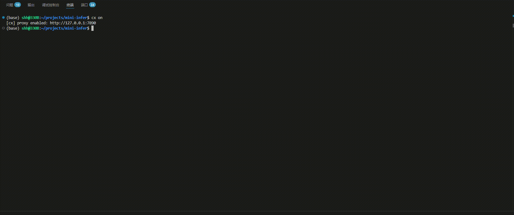
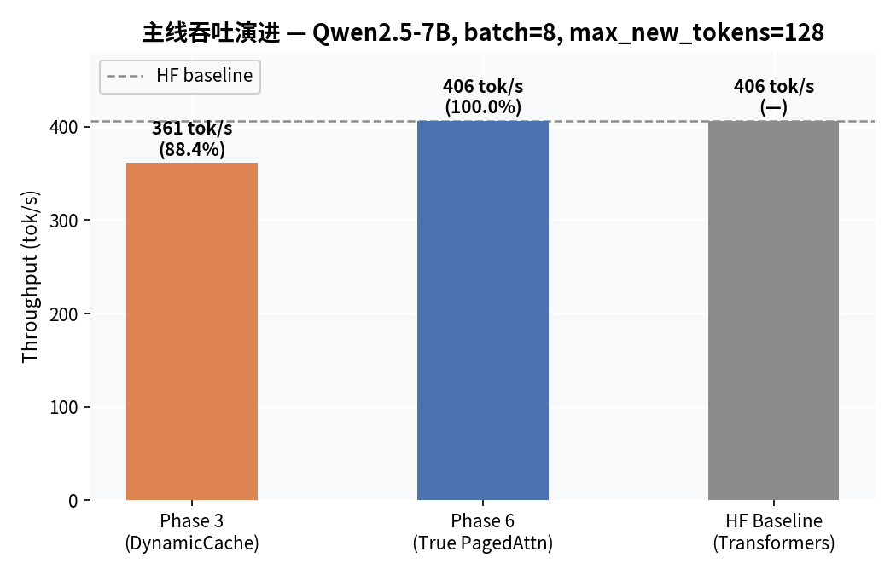
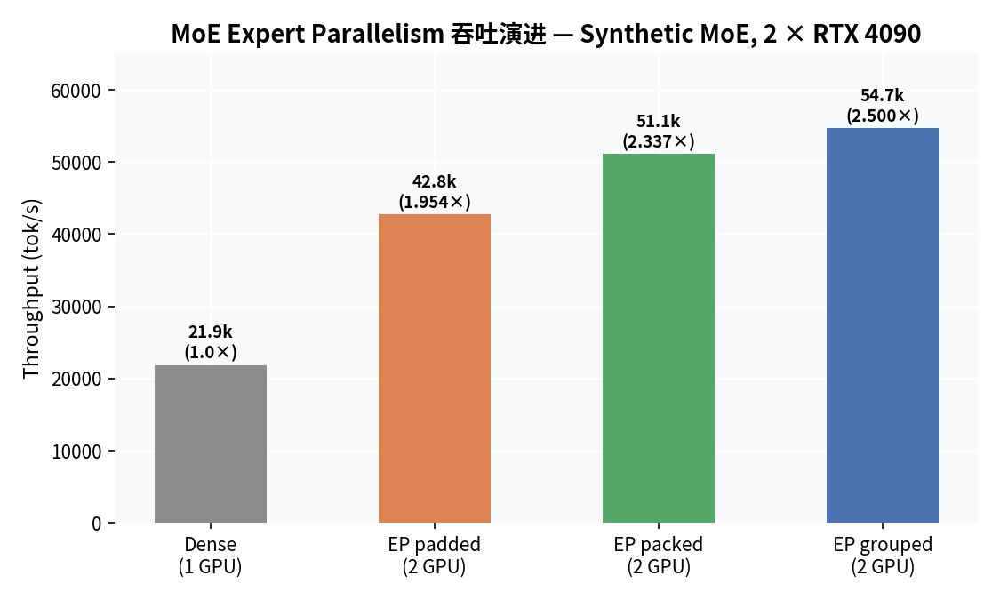
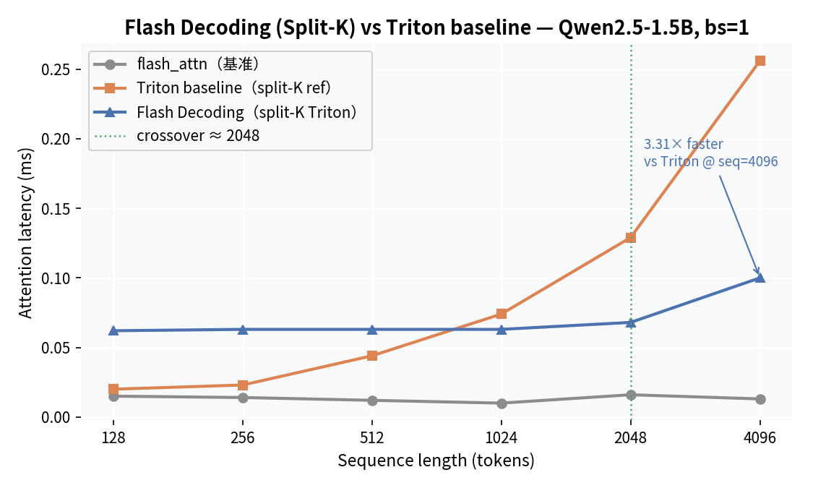
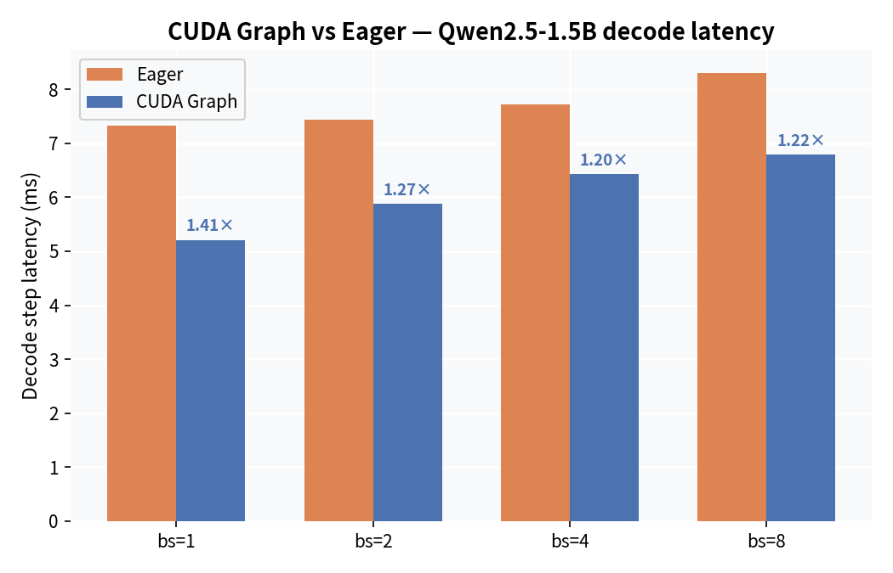
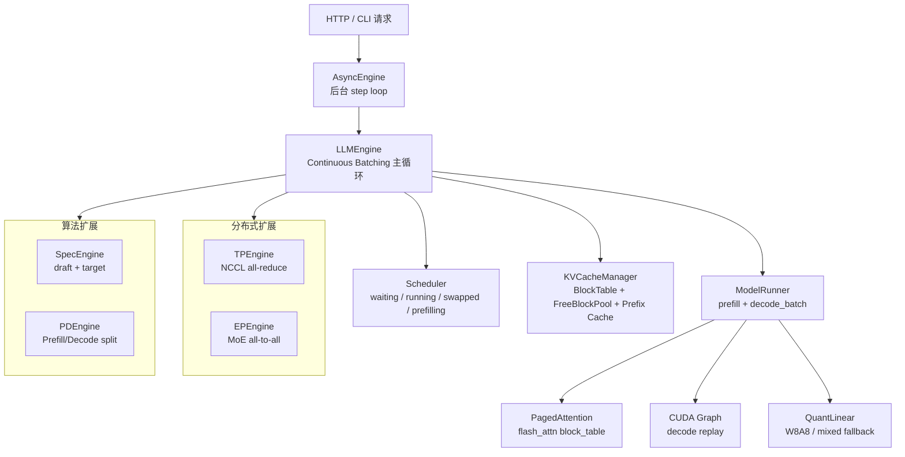

# mini-infer

**LLM inference engine built from scratch** — paged KV cache, continuous batching, chunked prefill, prefix caching, speculative decoding, CUDA graph, tensor parallelism, MoE expert parallelism, and OpenAI-compatible HTTP serving. Each mechanism has a dedicated benchmark with quantitative results. Core serving path reaches **100% of HF baseline throughput** at batch=8. Ships with dry-run mode (no model weights needed), `/healthz`, Docker, and CI.

> 从零实现的 LLM 推理引擎。核心 serving 路径（PagedAttention + Continuous Batching + OpenAI HTTP API）在 Qwen2.5-7B 达到 HF Transformers **100% 吞吐**，支持 `--dry-run` 无权重启动验证。

[](https://github.com/psmarter/mini-infer/actions/workflows/smoke.yml)
[](https://github.com/psmarter/mini-infer/actions/workflows/lint.yml)




---

## 立即验证（无需模型权重）

```bash
pip install -e ".[serve,dev]"
mini-infer-serve --dry-run --port 8000
curl http://localhost:8000/healthz   # → {"status":"ok","model":"dry",...}
```

---

## 如何阅读这个仓库

5 个文件覆盖核心推理机制，建议按序阅读：

| 文件 | 内容 |
|------|------|
| [`mini_infer/cache/kv_cache.py`](mini_infer/cache/kv_cache.py) | Paged KV Cache：BlockTable、FreeBlockPool、prefix cache LRU eviction |
| [`mini_infer/runtime/scheduler.py`](mini_infer/runtime/scheduler.py) | 四队列调度器：waiting / running / swapped / prefilling，preemption，chunked prefill |
| [`mini_infer/runtime/async_engine.py`](mini_infer/runtime/async_engine.py) | Continuous batching：后台 step loop + asyncio.Queue，HTTP 请求合并入同一 decode_batch |
| [`mini_infer/serving/server.py`](mini_infer/serving/server.py) | OpenAI Chat Completions HTTP API：SSE streaming、non-streaming、`/healthz` |
| [`mini_infer/parallel/tp_engine.py`](mini_infer/parallel/tp_engine.py) | Tensor Parallelism：NCCL all-reduce，Megatron-LM 风格列/行并行 |

分布式 / 量化扩展另见 [`mini_infer/modeling/quantization.py`](mini_infer/modeling/quantization.py)、[`mini_infer/parallel/ep_engine.py`](mini_infer/parallel/ep_engine.py)。

---

## 核心成果

**主 serving 路径（`mini-infer-serve` 默认启动）**

| 技术 | 关键数据 |
|------|---------|
| **True PagedAttention**（flash_attn block_table） | batch=8 吞吐达到 HF Transformers **100%**（406 tok/s） |
| **Chunked Prefill** | 混合 serving 场景 ITL spike 降低 **57%–67%** |
| **Prefix Caching**（block-level hash + LRU） | 共享前缀 TTFT **−22%** |

**独立 benchmark 实验（功能完整，未接入默认 serving 路径）**

| 技术 | 关键数据 |
|------|---------|
| **Speculative Decoding**（0.5B draft + 7B target） | acceptance rate **55.85%** |
| **CUDA Graph**（decode_batch 静态捕获） | 1.5B bs=1 decode 延迟 **−28.9%** |
| **Flash Decoding**（Triton split-K） | seq=4096 延迟 **3.31×** vs 标准 Triton，SM 利用率 9%→103% |
| **Tensor Parallelism**（NCCL all-reduce，Megatron-LM 风格） | TP=2 greedy 输出与单卡**完全一致**（见注 ¹） |
| **MLA**（DeepSeek-V2/V3 架构） | latent cache 体积 **−56.25%** vs GQA |
| **MoE Expert Parallelism**（Grouped Local Execution） | EP grouped / dense = **2.500×** |

**原型实现（correctness-first，有明确边界限制）**

| 技术 | 关键数据 |
|------|---------|
| **W8A8 量化**（per-channel int8 + mixed fallback） | 权重显存 **−32.4%**，greedy match 71.8%（见注 ²） |
| **PD 解耦**（同机双进程） | TTFT 三段分解：prefill 12.3ms / transfer ≈14.7ms / decode 519ms |

完整 benchmark 数据与复现命令见 [docs/benchmarks.md](docs/benchmarks.md)。

| 主线吞吐演进 | MoE EP 吞吐演进 |
|:-----------:|:--------------:|
|  |  |

| Flash Decoding（seq_len sweep） | CUDA Graph decode 延迟 |
|:-------------------------------:|:---------------------:|
|  |  |

> ¹ **TP 说明**：1.5B 模型规模下，2 卡 NCCL all-reduce 通信开销超过计算节省，吞吐未提升；当前验收结论为 greedy 输出与单卡完全一致（正确性已验证）。TP 适用于单卡显存不足时的大模型横向扩展。
>
> ² **W8A8 说明**：decode 路径受限于 `torch._int_mm` 小 M 瓶颈，退回 FP16 mixed fallback（显存节省有效，decode 速度无明显提升）；greedy match 71.8% 为 correctness-first 实现，未做 PTQ/AWQ 校准。

---

## 快速开始

```bash
git clone https://github.com/psmarter/mini-infer && cd mini-infer
pip install -e ".[serve,dev]"

# 无需模型权重，立即验证服务接口
mini-infer-serve --dry-run --port 8000

# 真实模型（需要 Qwen2.5-7B-Instruct）
mini-infer-serve --model /path/to/Qwen2.5-7B --port 8000

# 开启 CUDA Graph + W8A8 量化
mini-infer-serve --model /path/to/Qwen2.5-7B --use-cuda-graph --quant-mode w8a8 --port 8000
```

```bash
curl http://localhost:8000/v1/chat/completions \
  -H "Content-Type: application/json" \
  -d '{"model":"mini-infer","messages":[{"role":"user","content":"Hello"}],"stream":false}'
```

Python 完整示例（streaming / 多轮对话）见 [`examples/openai_client.py`](examples/openai_client.py)。

---

## 架构



详细模块说明见 [docs/architecture.md](docs/architecture.md)。

---

## 能力状态

| 能力 | 状态 | 关键数据 |
|------|------|---------|
| Paged KV Cache + Continuous Batching | ✅ 主链路 | 主推理路径核心 |
| Chunked Prefill | ✅ 主链路 | ITL spike −57%–67% |
| Prefix Caching（block-level hash + LRU） | ✅ 主链路 | TTFT −22% |
| True PagedAttention（flash_attn block_table） | ✅ 主链路 | batch=8 达到 HF **100%** |
| OpenAI Chat Completions HTTP API | ✅ 主链路 | SSE streaming / non-streaming |
| Speculative Decoding（0.5B draft + 7B target） | 🔬 独立实验 | acceptance 55.85%（SpecEngine，未接入 serve CLI） |
| CUDA Graph（decode_batch 静态捕获） | 🔬 独立实验 | decode 延迟 −28.9%（`--use-cuda-graph` 实验开关） |
| Flash Decoding（Triton split-K） | 🔬 独立实验 | 3.31× vs 标准 Triton，SM 9%→103% |
| Triton decode attention kernel | 🔬 独立实验 | 对比 flash_attn，未接入主链路 |
| Tensor Parallelism（NCCL all-reduce） | 🔬 独立实验 | greedy 输出与单卡一致（正确性验证） |
| MLA（DeepSeek-V2/V3 latent cache） | 🔬 独立实验 | cache 体积 −56.25% vs GQA |
| MoE Expert Parallelism（synthetic workload） | 🔬 独立实验 | EP grouped / dense = 2.500× |
| W8A8 量化（per-channel int8） | 🔧 原型 | 显存 −32.4%，greedy match 71.8% |
| PD 解耦（同机双进程） | 🔧 原型 | TTFT 三段分解（prefill/transfer/decode） |

> ✅ 主链路：接入完整 serving 路径，可通过 HTTP API 端对端验证
> 🔬 独立实验：独立 benchmark 脚本，有量化数据，未接入主 serving 链路
> 🔧 原型：功能已实现，correctness-first，有边界限制（见注 ¹²）

---

## 目录结构

```
mini_infer/
├─ core/        # EngineConfig、Request、SamplingParams
├─ runtime/     # LLMEngine、Scheduler、AsyncEngine、SpecEngine、PDEngine
├─ cache/       # KVCacheManager（BlockTable + Prefix Cache）
├─ modeling/    # ModelRunner、量化、MLA、MoE
├─ kernels/     # PagedAttention、Triton decode、Flash Decoding
├─ parallel/    # TP、EP、Replica、PP
└─ serving/     # FastAPI server、OpenAI schema

benchmarks/     # 每项能力对应一个 benchmark 脚本（21 个）
tests/          # 287 collected items（含参数化展开），大多数支持 dry_run，不依赖模型权重
```

`make test-fast` 跑 CPU dry-run 全量测试（约 10s）；`make test` 含 GPU 专项。

---

## 文档

| 文档 | 内容 |
|------|------|
| [docs/architecture.md](docs/architecture.md) | 包结构、模块说明、请求生命周期 |
| [docs/benchmarks.md](docs/benchmarks.md) | 所有能力的 benchmark 数据与复现命令 |
| [docs/faq.md](docs/faq.md) | 常见问题：安装、环境、CUDA Graph / W8A8 开关 |
| [docs/roadmap.md](docs/roadmap.md) | 后续扩展方向与已知 gap |

---

## 与 vLLM 的区别

| 维度 | mini-infer | vLLM |
|------|-----------|------|
| **目标** | 从零实现并测量关键推理机制 | 生产级：高吞吐、多模型、SLO 保障 |
| **PagedAttention** | 与 vLLM 同路线（flash_attn block_table） | 相同路线，更成熟 |
| **量化** | W8A8 手工实现，greedy match 71.8% | PTQ / AWQ / GPTQ 完整工具链 |
| **模型覆盖** | Qwen2.5 / DeepSeek-V2（synthetic MoE） | 数十种架构，自动适配 |
| **调度器** | 手工实现，四队列 + chunked prefill | 完整 SLO、KV 共享感知 |
| **部署** | 单机原型 | K8s、多机 RDMA、完整监控 |

---

## 环境

| 依赖 | 版本 |
|------|------|
| Python | 3.10+ |
| PyTorch | 2.1.2+cu121 |
| transformers | 4.43.4 |
| flash-attn | 2.5.9.post1（`block_size` 须为 256 的倍数） |
| CUDA | 12.1 / RTX 4090 |

---

## License

MIT
