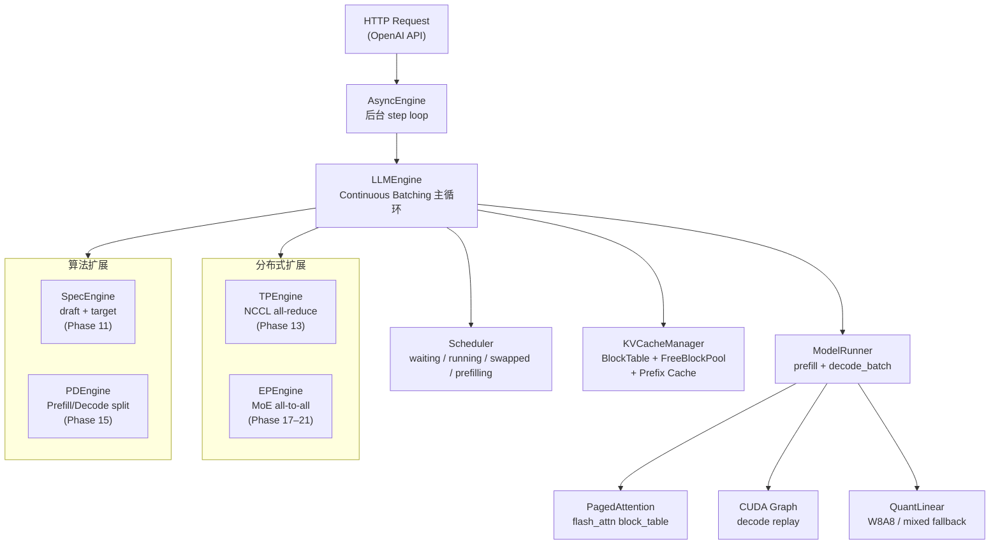

# mini-infer

> 从 PyTorch 原语出发，逐步实现 LLM 推理引擎的所有核心机制。
> 每个阶段有独立的 benchmark 和技术分析，帮你真正理解 vLLM / TRT-LLM / Megatron-LM 背后的设计权衡。


---

## 为什么做这个项目

大多数"LLM 推理入门"项目停留在 API 调用层，无法解释为什么 vLLM 要用 PagedAttention、为什么需要 Chunked Prefill、MoE 的 Expert Parallelism 到底在通信什么。

本项目的目标是：**每个优化机制都亲手实现一遍，用真实 benchmark 回答它在什么情况下有效、代价是什么、和工业系统的差距在哪里。**

环境：Ubuntu 24.04，2 × RTX 4090，Qwen2.5 系列模型（0.5B / 1.5B / 7B）。

---

## 核心成果

| 技术 | 关键数据 |
|------|---------|
| **True PagedAttention**（flash_attn block_table） | batch=8 吞吐达到 HF Transformers **100%**（406 tok/s） |
| **Chunked Prefill** | ITL spike 降低 **57%–67%** |
| **Prefix Caching**（block-level hash + LRU） | 共享前缀 TTFT **−22%** |
| **Speculative Decoding**（0.5B draft + 7B target） | acceptance rate **55.85%** |
| **CUDA Graph**（decode_batch 静态捕获） | 1.5B bs=1 decode 延迟 **−28.9%** |
| **Flash Decoding**（Triton split-K） | seq=4096 时 **3.31×** vs 标准 Triton kernel，SM 利用率 9% → 103% |
| **Tensor Parallelism**（NCCL all-reduce，Megatron-LM 风格） | TP=2 greedy 输出与单卡**完全一致** |
| **MLA**（DeepSeek-V2/V3 架构） | latent cache 体积 **−56.25%** vs GQA |
| **W8A8 量化**（per-channel int8 + mixed fallback） | 1.5B 权重显存 **−32.4%**，greedy match 71.8% |
| **MoE Expert Parallelism**（Grouped Local Expert Execution） | EP grouped / dense = **2.500×** |

---

## 快速开始

**无需模型权重**，30 秒验证项目可运行：

```bash
git clone https://github.com/psmarter/mini-infer
cd mini-infer
pip install -e ".[serve]"

python serve.py --dry-run --port 8000   # 启动 OpenAI 兼容 HTTP API
python quick_chat.py                     # 或者直接进入聊天
```

运行测试套件（大多数无需 GPU）：

```bash
pip install -e ".[dev]"
python -m pytest tests/ -q              # 287 tests passed
```

真实模型推理（需要 Qwen2.5-7B-Instruct）：

```bash
export MODEL=/path/to/Qwen2.5-7B-Instruct
export HF_HUB_OFFLINE=1
python benchmarks/benchmark_flash.py --model $MODEL --batch-size 8 --compare
```

---

## 架构



---

## 实现路线（21 个阶段）

| 主线 | 阶段 | 核心技术 | 代表指标 |
|------|------|---------|---------|
| Runtime 基础 | Phase 1–6 | Paged KV Cache + Continuous Batching + True PagedAttention | 100% HF baseline |
| 调度优化 | Phase 7–10 | Preemption / Chunked Prefill / Prefix Caching | ITL −67%，TTFT −22% |
| 算法加速 | Phase 11–12.5 | Speculative Decoding / CUDA Graph / Flash Decoding (Triton) | decode 延迟 −28.9% |
| 分布式扩展 | Phase 13–15 | Tensor Parallelism（NCCL）/ MLA / PD 解耦 | TP=2 greedy 与单卡一致 |
| 量化 | Phase 16 | W8A8 per-channel + mixed fallback | 权重显存 −32.4% |
| MoE / EP | Phase 17–21 | Expert Parallelism / True Sharding / Non-Padded / Grouped Execution | EP grouped / dense = 2.500× |

<details>
<summary>展开完整阶段列表</summary>

| 阶段 | 内容 | 状态 |
|------|------|------|
| Phase 1 | 单卡最小推理链路（真实模型加载、串行 decode、HF baseline 对比） | ✅ |
| Phase 2 | Paged KV Cache + Prefill/Decode 分离 + Continuous Batching | ✅ |
| Phase 3 | gather_batch_kv 向量化 + DynamicCache（batch=8 吞吐 +79.8%） | ✅ |
| Phase 4 | 双卡扩展（Replica + HF Pipeline Parallel） | ✅ |
| Phase 5 | Profiling + 技术总结 | ✅ |
| Phase 6 | True PagedAttention（flash_attn block_table，batch=8 达到 100% HF） | ✅ |
| Phase 6.5 | Triton decode attention kernel（online softmax，GQA，roofline 分析） | ✅ |
| Phase 7 | Preemption + Priority Scheduling（GPU↔CPU KV swap） | ✅ |
| Phase 8 | OpenAI Chat Completions 兼容 HTTP API（FastAPI + SSE + AsyncEngine） | ✅ |
| Phase 9 | Chunked Prefill（ITL spike −57% @ chunk=256） | ✅ |
| Phase 10 | Prefix Caching（block-level hash + LRU，TTFT −22%） | ✅ |
| Phase 11 | Speculative Decoding（0.5B draft + 7B target，acceptance_rate 55.85%） | ✅ |
| Phase 12 | CUDA Graph（decode_batch 静态捕获，1.5B bs=1 延迟 −28.9%） | ✅ |
| Phase 12.5 | Flash Decoding（Triton split-K，1.5B seq=4096 延迟 3.31× vs triton_65） | ✅ |
| Phase 13 | Tensor Parallelism（真 TP，NCCL all-reduce，Megatron-LM 风格） | ✅ |
| Phase 14 | MLA（DeepSeek-V2/V3 架构，latent cache −56.25% vs GQA，矩阵吸收优化） | ✅ |
| Phase 15 | PD 解耦（同机双进程，KV 序列化传输，TTFT 三段分解） | ✅ |
| Phase 16 | W8A8 量化（per-channel int8，attention 层跳过，混合 fallback） | ✅ |
| Phase 17 | MoE + Expert Parallelism（synthetic MoE + 2-GPU，EP / dense = 1.891×） | ✅ |
| Phase 18 | True Expert Sharding（per-rank local expert shard，shard_ratio = 0.5002） | ✅ |
| Phase 19 | Non-Padded EP Dispatch（ep_packed_bytes = ep_ideal_bytes，2.323×） | ✅ |
| Phase 20 | EP Control Plane 收敛（control_plane_share ≈ 1.94%，2.310×） | ✅ |
| Phase 21 | Grouped Expert Execution（EP grouped / dense = 2.500×，resident ratio 0.8334） | ✅ |

</details>

---

## 性能数据

### 单卡吞吐演进（Qwen2.5-7B-Instruct，batch=8，max_new_tokens=128）

| 实现 | batch=8 吞吐 | vs HF |
|------|------------|-------|
| HF Transformers baseline | ~406 tok/s | 100% |
| Phase 1（串行 decode） | 56 tok/s | 13.8% |
| Phase 2（Paged KV + Batch Decode） | 201 tok/s | 49.5% |
| Phase 3（向量化 gather + DynamicCache） | 361 tok/s | 88.4% |
| **Phase 6（True PagedAttention）** | **406 tok/s** | **100.0%** |

### MoE Expert Parallelism 演进（synthetic MoE，2×RTX 4090）

| 实现 | 吞吐（tok/s） | vs dense |
|------|------------|---------|
| Dense（1 GPU） | ~22,000 | 1.00× |
| EP padded（2 GPU） | ~43,000 | ~1.96× |
| EP packed（2 GPU） | ~52,000 | ~2.32× |
| **EP grouped（2 GPU）** | **~54,700** | **2.500×** |

### 各阶段关键数据

| 阶段 | 指标 |
|------|------|
| Chunked Prefill（Phase 9） | ITL spike −57%（chunk=256）；−67%（chunk=128） |
| Prefix Caching（Phase 10） | 共享 1 个 block 时 TTFT −22% |
| Speculative Decoding（Phase 11） | acceptance_rate 55.85%，0.5B draft + 7B target |
| CUDA Graph（Phase 12） | 1.5B bs=1 decode 延迟 −28.9% |
| Flash Decoding（Phase 12.5） | 1.5B seq=4096 延迟 3.31× vs 标准 Triton；SM 利用率 9% → 103% |
| W8A8 量化（Phase 16） | 1.5B 权重显存 −32.4%（3392→2292 MB），greedy match 71.8% |
| PD 解耦（Phase 15） | TTFT 分解：prefill 12.3ms / transfer ≈14.7ms / decode 519ms |

---

## 运行 Benchmark

### 核心主线（Phase 6，需要 Qwen2.5-7B）

```bash
export MODEL=/path/to/Qwen2.5-7B-Instruct
export HF_HUB_OFFLINE=1

# HF baseline 对照
python benchmarks/benchmark_hf.py --model $MODEL --batch-size 8 --max-new-tokens 128

# mini-infer 主线（True PagedAttention）
python benchmarks/benchmark_flash.py --model $MODEL --batch-size 8 --compare
```

### MoE Expert Parallelism（Phase 17–21，需要 2 GPU，无需模型权重）

```bash
python benchmarks/benchmark_moe.py \
    --compare --batch-size 4 --seq-len 16 \
    --hidden-size 512 --intermediate-size 1024 \
    --num-experts 8 --top-k 2 --dtype float16 \
    --warmup 2 --runs 5 --src-rank 1
```

### W8A8 量化（Phase 16，需要 Qwen2.5-1.5B）

```bash
export QUANT_MODEL=~/.cache/huggingface/hub/models--Qwen--Qwen2.5-1.5B-Instruct/snapshots/989aa7980e4cf806f80c7fef2b1adb7bc71aa306
python benchmarks/benchmark_quant.py --model $QUANT_MODEL --compare --batch-size 4
```

<details>
<summary>展开全部 benchmark 命令（Phase 6.5 ~ Phase 15）</summary>

#### Triton Kernel（Phase 6.5，无需模型权重）

```bash
python benchmarks/benchmark_triton.py
python -m pytest tests/test_triton_attn.py -v
```

#### Preemption（Phase 7）

```bash
python benchmarks/benchmark_preemption.py --dry-only   # 无需模型权重
python benchmarks/benchmark_preemption.py              # 需要 Qwen2.5-7B
```

#### HTTP Server + Chunked Prefill（Phase 8/9）

```bash
python serve.py --dry-run --port 8000
python serve.py --model $MODEL --chunk-prefill-size 256 --port 8000
python benchmarks/benchmark_chunked_prefill.py --model $MODEL --chunk-size 256
```

#### Prefix Caching（Phase 10）

```bash
python benchmarks/benchmark_prefix_cache.py --dry_run
python benchmarks/benchmark_prefix_cache.py --model $MODEL --batch_size 8
```

#### Speculative Decoding（Phase 11）

```bash
python benchmarks/benchmark_spec.py --dry_run
python benchmarks/benchmark_spec.py --draft auto --target auto --K 4 --target_only
```

#### CUDA Graph（Phase 12）

```bash
python benchmarks/benchmark_cuda_graph.py \
    --model ~/.cache/huggingface/hub/models--Qwen--Qwen2.5-1.5B-Instruct/snapshots/989aa7980e4cf806f80c7fef2b1adb7bc71aa306 \
    --num-kv-heads 2 --head-dim 128 --num-layers 28
```

#### Flash Decoding（Phase 12.5，无需模型权重）

```bash
python benchmarks/benchmark_flash_decode.py
python benchmarks/benchmark_flash_decode.py --num-q-heads 28 --num-kv-heads 4
```

#### Tensor Parallelism（Phase 13）

```bash
export TP_MODEL=~/.cache/huggingface/hub/models--Qwen--Qwen2.5-1.5B-Instruct/snapshots/989aa7980e4cf806f80c7fef2b1adb7bc71aa306
torchrun --nproc_per_node 2 benchmarks/benchmark_tp.py --model $TP_MODEL --mode torchrun_tp
```

#### MLA（Phase 14，需要 DeepSeek-V2-Lite）

```bash
python benchmarks/benchmark_mla.py --section 1   # 理论 KV 大小（无需权重）
python benchmarks/benchmark_mla.py --section 2   # 真实显存测量
python benchmarks/benchmark_mla.py --section 3   # 三种实现延迟对比
```

#### PD 解耦（Phase 15）

```bash
TOKENIZERS_PARALLELISM=false HF_HUB_OFFLINE=1 \
    python benchmarks/benchmark_pd_disagg.py --section 3   # TTFT 三段分解
```

</details>

---

## 项目结构

<details>
<summary>展开完整文件结构</summary>

```
mini_infer/
  engine.py              LLMEngine：continuous batching 主循环
  scheduler.py           Scheduler：waiting/running/swapped/prefilling 队列
  kv_cache.py            KVCacheManager：Paged KV Cache + Prefix Cache
  attention.py           PagedDecodeContext + patch（Phase 6）
  model_runner.py        ModelRunner：prefill + decode_batch + CUDA Graph
  quantization.py        QuantLinear / quantize_model（W8A8，Phase 16）
  moe_layer.py           TopKRouter / MoELayer / EPMoELayer（Phase 17–21）
  moe_model.py           SyntheticMoEConfig / SyntheticMoEModel
  ep_engine.py           2-GPU EPEngine（NCCL all-to-all，Phase 17–21）
  async_engine.py        AsyncEngine：后台 step loop + asyncio.Queue
  server.py              FastAPI HTTP server（OpenAI Chat Completions 子集）
  tp_engine.py           TPEngine：真 TP（NCCL all-reduce，Phase 13）
  tp_model_runner.py     Megatron-LM 风格权重切分 + all-reduce hook
  spec_engine.py         SpecEngine：draft + target speculative decoding
  mla_attention.py       MLA 三种实现（Naive / LatentCache / Absorbed）
  pd_engine.py           PDEngine：Disaggregated Prefill/Decode
  triton_attn.py         Triton decode attention kernel（Phase 6.5）
  triton_flash_decode.py Flash Decoding split-K kernel（Phase 12.5）

serve.py                 HTTP server CLI 入口
quick_chat.py            一键 dry-run 聊天
benchmarks/              每个 phase 对应一个 benchmark 脚本（21 个）
tests/                   测试套件（35+ 模块，287 tests，大多数支持 dry_run）
本地资料/                实验记录、阶段里程碑总结、博客草稿
```

</details>

---

## 设计边界

- Phase 17–21 的 MoE/EP benchmark 基于 **synthetic layer-level workload**（单层 MoE forward），不包含完整 serving 链路
- Phase 16 量化是 W8A8 **第一版原型**，非 AWQ/SmoothQuant 级别精度优化；decode 路径以 int8 权重 + float activation 的 mixed fallback 为主
- Tensor Parallelism 以 Qwen2.5-1.5B 验证正确性，未在 7B 上做完整吞吐对比
- 项目面向学习闭环，不是生产 serving 系统

每个阶段的 prototype 边界和 benchmark 口径在 `本地资料/里程碑总结/` 和 `本地资料/实验记录/` 中有详细说明。

---

## 环境

| 依赖 | 版本 |
|------|------|
| Python | 3.10+ |
| PyTorch | 2.1.2+cu121 |
| transformers | 4.43.4 |
| flash-attn | 2.5.9.post1 |
| CUDA | 12.1 |

```bash
pip install -e ".[serve,dev]"   # 安装所有依赖
```

注意：真实模型推理时 `block_size` 必须是 256 的倍数（flash_attn_with_kvcache 对齐要求）。
