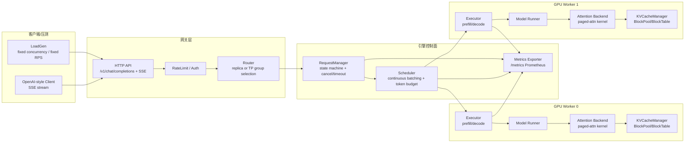
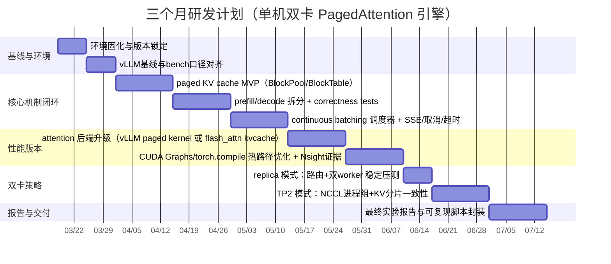

# 单机双卡环境下 PagedAttention 高性能推理引擎实现报告

## 执行摘要

本报告将你已有的两份材料（本地文件 `/mnt/data/deep-research-report.md` 与 `/mnt/data/AI推理项目优化与路线图.md`）进行**融合、去冗余、聚焦工程落地**，只保留与“在单机双卡（RTX 4090 ×2）上实现基于 PagedAttention 的高性能推理引擎”直接相关的核心内容。

项目的技术主线是：以 **PagedAttention 的分页式 KV cache（paged KV cache）** 为核心，围绕在线推理的关键瓶颈（KV cache 动态增删导致碎片与冗余、吞吐与延迟权衡、CPU 侧调度开销、双卡通信开销）构建一个端到端引擎：**paged KV cache（BlockPool/BlockTable）→ prefill/decode 拆分 → continuous batching（可选 chunked prefill）→ 流式 SSE → Prometheus metrics → 可复现 benchmark + Nsight/torch.profiler 定位**。PagedAttention 论文与 vLLM 的实现共同强调：高吞吐 serving 的关键限制来自“巨大且动态变化的 KV cache”，PagedAttention 的分页管理可以将 KV cache 浪费逼近零，并在相近延迟水平下显著提升吞吐（论文报告相对 FasterTransformer、Orca 等系统可达 2–4× 吞吐提升）。citeturn10search4

在双卡场景下，本报告给出两条并行策略并明确取舍：  
- **优先落地（推荐先做）**：双卡“**两实例（replica）**”，每张卡独立引擎与 KV cache，通过路由层做请求粘滞分配；吞吐最佳、实现复杂度最低。  
- **进阶（第二阶段）**：**Tensor Parallel = 2（TP2）** 单模型跨两卡，以减模型权重/激活/kv 压力、扩大 KV 空间与支持更大模型；采用 NCCL 通信与进程绑定（每进程独占 GPU，避免 NCCL 死锁风险）。citeturn6search8turn5search0

为了在 3 个月内达到“高性能 + 可复现”的成功标准，报告把成功定义为**一组可量化指标 + 基线对照**：对照 vLLM（作为行业对标基线）与 naive contiguous KV baseline，按固定 benchmark 套件计算 tokens/s、TTFT/TPOT/ITL（p50/p95/p99）、显存峰值、最大并发、KV block 使用率与内存泄漏率，并给出可复现的结果记录格式（JSONL/CSV）与 profiling 命令。citeturn0search3turn1search1turn5search0

## 项目目标与成功量化指标

### 项目目标

目标不是“复刻全部 vLLM”，而是实现一个**足够高性能、结构清晰、可验证**的 PagedAttention 推理引擎，能在单机双卡上稳定运行并通过标准化 benchmark 证明收益。

### 成功标准与量化指标定义

下表定义“必须产出”的指标、计算口径与合格阈值（阈值采用**相对基线 + 绝对健康阈值**的组合，避免对特定模型/参数做不靠谱的绝对承诺）。

| 指标 | 定义/口径 | 采集方式 | 合格阈值（建议） |
|---|---|---|---|
| 吞吐 `tokens/s` | 全局输出 tokens 总数 / 总耗时（可同时报告 prompt 与 decode 吞吐） | LoadGen 统计 + 服务器端计数器 | 相对 contiguous baseline ≥ **1.5×**；相对 vLLM ≥ **70%**（同模型同参数）citeturn10search4turn0search3 |
| `TTFT p50/p95` | 请求提交到首 token 产生的延迟 | SSE 首 token 时间戳 | p95 不随并发“失控”（给出曲线 + 调参策略）；并能解释 prefill/队列/调度贡献citeturn0search3turn6search8 |
| `TPOT p50/p95` | `(E2E - TTFT)/(output_tokens-1)`（vLLM benchmark 同口径） | 每请求 E2E/TTFT | 相对 contiguous baseline 明显下降（≥10%）；并能用 profiling 解释瓶颈变化citeturn0search4turn7search4 |
| `ITL p50/p95` | token 间隔延迟（inter-token latency） | 解析 SSE token 时间戳 | p95 受 chunked prefill/预算调参可控（提供建议区间与曲线）citeturn6search8turn0search3 |
| 显存峰值 `vram_peak_gb` | 推理期间单卡显存最大占用 | `torch.cuda.max_memory_allocated()` + NVML（可选） | 峰值可重复（多次 run 变异 <5%）；无逐步爬升迹象（泄漏） |
| 最大并发 `max_concurrency` | 在给定 workload（prompt/output 分布）与显存预算下不 OOM 且满足 TTFT/ITL 阈值的最大并发 | 二分搜索并发 | 相对 contiguous baseline 提升（建议 ≥1.5×）；给出“并发—吞吐—延迟”三维结果 |
| KV block 使用率 `kv_cache_usage_perc` | `used_blocks/total_blocks`（0–1） | KVCacheManager 计数；对齐 vLLM 指标命名 | 长稳压测后曲线稳定且能与并发/上下文长度匹配；无“持续逼近 1.0 直到 OOM”的异常citeturn1search1 |
| 内存泄漏率 `leak_rate` | 所有请求结束 + 强制回收后仍占用 blocks / 总 blocks | 回收后读 `used_blocks` | 压测后 `leak_rate < 0.1%`（且能定位到具体 request id / code path） |

补充说明：vLLM 的 benchmark/metrics 文档明确了 `ttft/tpot/itl/e2el` 这些 request-level 指标口径与可输出分位数参数（`--percentile-metrics`、`--metric-percentiles`），以及 `vllm:kv_cache_usage_perc` 等 KV cache 相关指标，你应尽量对齐同名口径，便于对照与汇报。citeturn0search3turn1search1turn0search6

## 总体架构与技术路线

### 总体技术路线

技术路线按“先正确、再高并发、再极致性能”三层推进：

1. **机制闭环（必须）**：实现 paged KV cache（BlockPool/BlockTable），prefill/decode 拆分，continuous batching 调度；能正确生成并可流式返回。  
2. **可观测与可复现（必须）**：SSE 首 token/逐 token 时间戳、Prometheus `/metrics`、benchmark 工具输出 JSONL/CSV。citeturn1search1turn4search3  
3. **性能上限（强烈建议）**：  
   - decode 热路径引入 CUDA Graphs/torch.compile reduce-overhead，压低 kernel launch overhead 与抖动；CUDA Graphs 被用于减少大量小 kernel 的 launch 开销并提升一致性。citeturn7search0turn7search1turn7search2  
   - attention 后端从“gather 到 contiguous 再 SDPA”升级为真正的 paged attention kernel（推荐对接 vLLM PagedAttention kernel 或 FlashAttention 的 paged KV 接口）。citeturn19view1turn16view1turn16view2

### 架构图

下面架构图显式标出你必须实现/提供的模块边界（方便写代码与做测试），并为“双卡两实例”与“TP2”两种运行模式留出扩展点。



与此架构一致的“paged attention kernel”在 vLLM 文档中给出了关键输入张量布局（例如 `k_cache`/`v_cache` 的 block 化布局）与 `BLOCK_SIZE`（每个 KV block 的 token 数）、`PARTITION_SIZE`（tensor parallel GPU 数）等概念。citeturn19view1

### 在线示意图

image_group{"layout":"carousel","aspect_ratio":"16:9","query":["PagedAttention KV cache block table diagram vLLM","continuous batching LLM inference serving architecture diagram","NVIDIA Nsight Systems timeline CUDA graphs example"],"num_per_query":1}

## 环境准备与基线搭建

### 推荐环境矩阵

单机双卡 RTX 4090 属于 Ada 架构（Compute Capability 8.9），CUDA 生态支持从 CUDA 11.8 起持续“ongoing”。citeturn14search1  
为减少环境不确定性，建议统一到 CUDA 12.8/12.9 家族，并使用与之匹配的 PyTorch/vLLM 预编译轮子。

| 组件 | 推荐版本/范围 | 依据与说明 |
|---|---|---|
| NVIDIA Driver | Linux x86_64 ≥ **525.60.13**（CUDA 12.x minor compatible） | CUDA 12.8 release notes 给出 CUDA 12.x 的最小驱动版本要求；同时 CUDA 11+ 支持 minor version compatibility。citeturn14search0turn14search2 |
| CUDA Toolkit | 12.8 或 12.9（优先与 PyTorch/vLLM wheel 对齐） | vLLM wheel 目前默认编译在 CUDA 12.9；并支持选择 cu128/cu126 等变体。citeturn13search0turn12view0 |
| cuDNN / NCCL | 以 PyTorch wheel 自带为准（运行时打印版本） | PyTorch 轮子会打包对应 CUDA 生态依赖；避免“系统 CUDA 库”与 wheel 版本混用导致奇怪错误。citeturn12view0 |
| Python | 3.11（或 3.10+） | PyTorch 2.10 支持多版本 Python；版本选择以生态兼容与编译速度为主。citeturn2search2turn2search3 |
| PyTorch | **2.10.0**（CUDA 12.8/12.9 变体） | PyTorch 2.10 wheel variants 支持 CUDA 12.6/12.8/13.0 等；vLLM v0.17 也升级到 PyTorch 2.10。citeturn2search2turn12view0 |
| Triton Language | 3.5.1（用于自定义 kernel/对照实验） | PyPI 记录的发布版本。citeturn4search0 |
| vLLM（基线/对标） | **v0.17.1** | GitHub Release：v0.17.1 于 2026-03-11 发布；v0.17.0 明确升级 PyTorch 2.10 并提示 CUDA 库路径混用风险。citeturn12view0 |
| FlashAttention（可选高性能后端） | 从源码编译安装 `flash-attn` | 官方 README：支持 RTX 4090（Ada），支持 fp16/bf16；并包含 paged KV cache（PagedAttention）与 `flash_attn_with_kvcache(..., block_table=...)` 接口。citeturn20view0turn16view1turn16view2 |
| TGI（可选对照） | v3.3.5（仅作为参考/对照） | TGI release 列表；但仓库声明进入 maintenance mode，并推荐迁移/使用 vLLM 等引擎。citeturn4search1turn4search2 |

### 环境落地步骤

下面给出“最小可复现”流程（建议写成 `scripts/setup_env.sh` 与 `docs/env.md`，并在 CI/README 固化）。

**驱动与 CUDA 一致性检查**（核心原则：**运行时不要混用系统 CUDA so 与 PyTorch/vLLM wheel 的 CUDA 依赖**，否则可能出现 `CUBLAS_STATUS_INVALID_VALUE` 等库不匹配问题；vLLM v0.17.0 release notes 明确指出了类似问题并给出处理建议）。citeturn12view0

**关键验证命令（示例）**：
```bash
nvidia-smi
python -c "import torch; print(torch.__version__); print(torch.version.cuda); print(torch.cuda.get_device_name(0)); print(torch.cuda.get_device_capability(0))"
python -c "import torch; print('cudnn', torch.backends.cudnn.version())"
```

### 基线搭建与对照基准

基线必须包含两类：

1. **外部对标基线：vLLM**  
   - 提供 OpenAI-compatible server 与标准 bench 工具（`vllm bench serve`），支持输出 `ttft/tpot/itl/e2el` 分位数，并可保存结果到 json（含 per-request 详情）。citeturn1search4turn0search3turn0search6  
   - metrics 端点暴露 `vllm:num_requests_running`、`vllm:num_requests_waiting`、`vllm:kv_cache_usage_perc` 等可观测指标。citeturn1search1turn11search3  

2. **内部对照基线：contiguous KV（naive）**  
   - 你自己的引擎实现一个“连续 KV cache”模式（例如预分配 `max_model_len` 的 KV 张量），目的不是性能，而是**证明 paged KV 的并发/显存效率优势**（同显存预算更高并发、更低碎片）。

vLLM Benchmark 建议你直接对齐其指标命名与输出格式（`ttft/tpot/itl/e2el`），因为这些口径已经被工具化，适合作为你项目的“真值对照”。citeturn0search3turn0search6

## 核心模块实施方案

本节按你要求的模块逐一给出：接口定义、数据结构示例、伪代码/关键代码要点，并明确 **MVP（可跑+可测）** 与 **Perf（高性能）** 两个实现层级。

### paged KV cache：BlockPool / BlockTable / alloc / free

#### 数据结构与内存布局

PagedAttention 的核心是把 KV cache 切成固定大小 blocks，并用 block table 把“逻辑序列”映射到“物理 blocks”。论文把痛点明确为：传统系统难以高效管理“巨大且动态变化的 KV cache”，导致碎片与冗余浪费；PagedAttention 借鉴 OS paging 技术解决此问题。citeturn10search4

**推荐数据结构（Python 表达，实际可迁移到 C++/Rust）**：

```python
from dataclasses import dataclass
from typing import List, Optional
import torch

@dataclass
class SeqState:
    req_id: str
    device: int                     # 0 or 1 (replica mode); TP2 mode里是rank的本地GPU
    prompt_len: int
    generated_len: int = 0
    status: str = "NEW"             # NEW/PREFILL/DECODE/DONE/CANCEL/TIMEOUT
    # block_table: logical_block_idx -> physical_block_id
    block_table: Optional[torch.Tensor] = None   # int32 [max_blocks_per_seq]
    # current write cursor
    cur_block: int = 0
    cur_offset: int = 0             # [0..block_size_tokens-1]
```

```python
class BlockPool:
    def __init__(self, num_blocks: int, device: int):
        self.device = device
        self.free = torch.arange(num_blocks, dtype=torch.int32, device="cpu")  # 可换成 lock-free ring
        self.top = num_blocks

    def alloc(self, n: int) -> torch.Tensor:
        # 返回 int32 [n] 的 block ids
        if self.top < n:
            raise RuntimeError("OOM_BLOCKS")
        self.top -= n
        return self.free[self.top:self.top+n].clone()

    def free_blocks(self, block_ids: torch.Tensor) -> None:
        n = block_ids.numel()
        self.free[self.top:self.top+n] = block_ids
        self.top += n
```

#### block size 与显存容量模型

你必须在设计文档里写清楚“block_size_tokens 如何影响：内存浪费上界、metadata 开销、gather/访存模式”。

- vLLM 的 paged attention kernel 把 `BLOCK_SIZE` 定义为“每个 block 的 token 数”；文档示例也使用 block size = 16 来解释内存布局与 warp 工作划分。citeturn19view1turn19view2  
- 若你打算直接使用 FlashAttention 的 `flash_attn_with_kvcache` paged KV 接口，需要满足它对 paged cache 形状的约束：当提供 `block_table` 时，`k_cache/v_cache` 形状为 `(num_blocks, page_block_size, nheads_k, headdim)` 且 `page_block_size` 需要满足文档约束；并且 `block_table` 是 `int32[batch_size, max_num_blocks_per_seq]`。citeturn16view1turn16view2  

**容量模型（用于设置 max_concurrency 与回收策略）**：  
令  
- `L` = transformer layers  
- `Hkv` = kv heads（TP2 情况下通常是每 rank 的 kv heads 数）  
- `D` = head_dim  
- `B` = block_size_tokens  
- `dtype_bytes` = 2（fp16/bf16）  
则单 block 的 KV bytes 近似：
`block_bytes ≈ 2(K+V) * L * Hkv * B * D * dtype_bytes`

你需要把该公式固化到 `tools/kv_capacity.py`，给定模型 config 自动算出：  
- 单卡 `num_blocks_total`（按显存预算）  
- 在给定 `prompt_len/out_len` 分布下的理论 max concurrency 上界（用于 sanity check）

#### alloc/free 与回收边界条件

必须覆盖以下边界条件（否则很容易出现“显存不释放/blocks 泄漏”）：

- **prefill**：按 `ceil(prompt_len / B)` 批量申请 blocks，写入 prompt 的 KV。  
- **decode**：每生成一个 token，写入 KV；当 block 填满时申请新 block（append 到 block_table）。  
- **终止**：EOS/stop/max_tokens/timeout/client disconnect/cancel 都必须走同一个 cleanup：释放所有 blocks。  
- **异常**：GPU kernel 抛错/请求解析失败，也必须释放已分配 blocks（用 `try/finally` 或 RAII 封装）。

建议提供 `KVCacheManager.free_req(req_id)` 的幂等实现（重复调用不出错），用于故障退化。

### prefill/decode 执行器：拆分与接口

prefill 和 decode 的计算形态不同，TTFT 的主要来源通常是 prefill 计算与排队/调度延迟；因此拆分并可观测是必须的。vLLM benchmark 将 `TTFT/TPOT/ITL/E2EL` 明确定义为核心指标并能直接输出分位数。citeturn0search3turn0search4

#### 执行器接口建议

```python
class Executor:
    def prefill(self, batch) -> None:
        """写入 prompt KV，并产生首 token logits（供 sampler 取首 token）。"""
        ...

    def decode_step(self, batch) -> None:
        """对 active sequences 做一次 token-step decode：读 KV、算 attention、写入新 KV。"""
        ...
```

#### attention 后端选择：MVP vs 高性能

你需要把 attention 后端做成可插拔，并在 README 里写清“为什么 MVP 先这样、性能版本再这样”。

**方案 A：对齐 vLLM PagedAttention kernel（推荐作为性能版本）**  
vLLM 文档给出了 kernel 的 core inputs 形状，尤其是与 paged KV cache 兼容的 `k_cache/v_cache` 布局：  
- `q: [num_seqs, num_heads, head_size]`  
- `k_cache: [num_blocks, num_kv_heads, head_size/x, block_size, x]`  
- `v_cache: [num_blocks, num_kv_heads, head_size, block_size]`  
并定义 `BLOCK_SIZE` 为每 block token 数，`PARTITION_SIZE` 表示 tensor parallel GPU 数（文档示例假设 0，即禁用 TP）。citeturn19view1turn1search0  

这意味着你只要把自己的 KVCacheManager 的物理存储布局对齐上述格式，就可以在性能版本中避免 “gather 到连续再算 attention” 的巨大开销。

**方案 B：FlashAttention 的 paged KV（可选性能版本/对照）**  
FlashAttention README 明确提供 `flash_attn_with_kvcache`，支持在一次 kernel 内完成“更新 KV cache + 做 attention”，并接受 `block_table`；当提供 `block_table` 时，`k_cache/v_cache` 可按 paged KV 形状组织。citeturn16view1turn16view2  
FlashAttention 同时明确支持 RTX 4090（Ada）与 fp16/bf16。citeturn20view0  

**方案 C：MVP（机制验证）——gather + PyTorch SDPA**  
MVP 你可以先把 paged blocks gather 成 contiguous KV，再调用 `torch.nn.functional.scaled_dot_product_attention`（SDPA）。PyTorch 文档说明 SDPA 有 flash/mem-efficient/math 三类实现，并尝试自动选择最优 backend；也可通过 `torch.nn.attention.sdpa_kernel()` 强制选择 backend。citeturn6search1turn6search2  
该方案的价值是：最快跑通 correctness + pipeline + metrics + benchmark；缺点是 gather 开销会吞掉一部分 paged KV 带来的收益，性能上限较低。

### continuous batching 调度器：策略、伪代码与调参

continuous batching 的目标是让 GPU 在 token-step 维持高利用率：每个 step 动态加入新请求、移除完成请求。与此同时，你必须处理“长 prompt prefill 会把 decode 饿死”的问题；vLLM 官方 tuning 文档用 `max_num_batched_tokens` 解释了 chunked prefill 的 TTFT/ITL/吞吐权衡，并给出调参方向。citeturn6search8

#### Scheduler 的队列与状态机

- `Q_prefill`: 新请求待 prefill  
- `Q_decode`: 活跃 decode 请求（通常是 list 或 deque）  
- `Q_wait`: 因 blocks 不足/限流暂时等待的请求（可选）

状态：`NEW -> PREFILL -> DECODE -> DONE/CANCEL/TIMEOUT`

#### 调度主循环伪代码（含 token budget 与回收）

```python
def engine_loop():
    while True:
        # 1) 回收：把 DONE/CANCEL/TIMEOUT 的 req 释放 blocks
        cleanup_finished()

        # 2) 选 decode batch（优先保障 ITL）
        decode_batch = pick_decode(Q_decode, max_num_seqs)

        # 3) 预留 decode 资源后，用剩余 token budget 做 chunked prefill
        remaining_budget = max_num_batched_tokens - len(decode_batch)  # decode按1 token计
        prefill_batch = pick_prefill(Q_prefill, remaining_budget, policy="chunked")

        # 4) 执行：prefill（可能多 token） + decode step（1 token）
        if prefill_batch:
            executor.prefill(prefill_batch)
        if decode_batch:
            executor.decode_step(decode_batch)

        # 5) 更新 metrics：running/waiting、iteration_tokens histogram、KV usage等
        update_metrics()
```

#### 关键调参项与预期影响

| 参数 | 作用 | 经验方向（先验） |
|---|---|---|
| `max_num_batched_tokens` | chunked prefill 的 token 预算，影响 prefill 与 decode 混合比例 | vLLM 文档给出：较小值改善 ITL；较大值可能改善 TTFT，并对吞吐有帮助；你需要通过曲线找到 sweet spot。citeturn6search8 |
| `max_num_seqs` | 每 step 允许的最大序列数 | 过大会增加调度/metadata 开销；过小会限制吞吐 |
| `block_size_tokens` | KV page/block 粒度 | 小：内部浪费上界低、metadata 大；大：相反；需与 kernel 约束对齐（特别是 FlashAttention 方案）citeturn19view1turn16view1 |

### SSE 流式、取消/超时回收与 Prometheus metrics

#### SSE（流式返回）与断连回收

流式输出是推理系统的核心体验能力之一，你需要做到：  
- 首 token 立刻下发（TTFT 可测）  
- 客户端断连能触发 cancel，并释放 blocks（否则会“幽灵占用”把 KV pool 吃空）

#### metrics：指标集合与命名建议

你应实现一套与你引擎一致的 `/metrics`（Prometheus 拉取），命名上建议对齐 vLLM 的关键指标集合，因为它已被工业监控实践验证：  
- `num_requests_running / waiting`  
- `kv_cache_usage_perc`（used/total）  
- `time_to_first_token_seconds`、`time_per_output_token_seconds` 等 bucket/histogramciteturn1search1turn1search3turn11search3  

同时参考 NVIDIA Triton Inference Server 的 `/metrics` 约定：默认提供 Prometheus 文本格式，按需可禁用。citeturn4search3

## 双卡并行策略与跨卡 KV 管理

本节给出双卡条件下的并行策略选择、KV 管理方案、NCCL/PCIe/P2P 通信策略、同步一致性与故障退化。

### 双卡并行的两条主路径

#### 路径一：双实例 replica（推荐先做）

**做法**：GPU0 跑一个完整引擎实例，GPU1 跑一个完整引擎实例；网关层把请求按 `req_id` 粘滞路由到某张卡（请求生命周期不迁移）。  
**优点**：  
- 无跨卡 KV 管理（KV 完全本地）  
- 无 per-step NCCL 代价；吞吐通常最好  
- 失败域清晰：一张卡挂了，另一张卡仍可服务（只损失一半容量）  
**缺点**：  
- 模型权重复制两份，单卡 24GB 可能限制可选模型大小

#### 路径二：Tensor Parallel = 2（TP2，进阶）

vLLM 的 parallelism 文档明确提出：Tensor Parallel 可以把模型参数按层内切分到多 GPU，从而降低单卡内存压力、为 KV cache 留出空间，并适用于单节点大模型推理。citeturn6search8turn13search5  

**做法（工程可行版）**：  
- 启动 2 个进程（rank0/rank1），各自绑定一张 GPU；用 NCCL 建立进程组。  
- 模型参数 sharding（例如 attention heads 分片），KV cache 在“head shard”维度自然分片（每 rank 只存自己那部分 heads 的 KV）。  
- 每 step 需要 NCCL collectives（典型为 all-reduce / all-gather，具体取决于线性层并行方式）。

**关键注意**：PyTorch 分布式文档明确指出：使用 NCCL 多进程时，每个进程必须对其使用的 GPU 拥有独占访问，否则可能死锁或非法用法。citeturn5search0

### 跨卡 KV 管理方案

#### replica 模式

- KVCacheManager 完全 per-worker 本地；`block_table` 只在该 worker 存在。  
- “跨卡 KV 管理”只发生在**路由层**：将请求固定到某张卡，并避免迁移（迁移需要大量 P2P copy，得不偿失）。

#### TP2 模式（推荐的 KV 分片一致性）

- **统一的逻辑 block_table**：对外仍然是 `logical_block_idx` 序列。  
- **每 rank 一份物理 block_table**：`block_table_rank[r]` 存该 rank 的物理 block ids。  
- 分配策略：当 seq 需要新 block，rank0/rank1 **同时在本地 BlockPool.alloc(1)** 分配，并把结果写到各自的 block_table。同一 `logical_block_idx` 在两 rank 上保持一致（但物理 id 不需相同）。  
- 释放：终止时两 rank 同步进入 cleanup，分别 free 对应 blocks。

这一方案避免了跨卡拷贝 KV，同时保持逻辑一致性；代价是分配/释放需要跨进程同步（可以通过在每 step 的控制面广播 “需要新增 blocks 的 seq 列表” 完成）。

### 通信策略与 P2P/PCIe

在单机双卡（无 NVLink）上，跨卡主要走 PCIe。你需要明确两类通信：

- **TP2 必需通信（NCCL collectives）**：每 step 的 all-reduce/all-gather。  
- **可选的 P2P（直接 GPU-to-GPU）**：用于 NCCL 优化或极端情况下的 KV/权重搬迁（通常不建议做请求迁移）。

NCCL 文档提供了 P2P 相关环境变量：  
- `NCCL_P2P_DISABLE=1` 可禁用 P2P；  
- `NCCL_P2P_LEVEL` 控制在什么拓扑距离下启用 P2P（NVLink/同 PCI switch/同 root complex 等）。citeturn5search1turn5search3  

**实践建议**：  
- 先在默认设置下建立 TP2 的正确性与基线性能；  
- 再通过 `NCCL_DEBUG=WARN`、`NCCL_P2P_LEVEL=PIX`（同 PCI switch 才启用）等做可控实验（写进 `bench/env/`），不要一次改太多变量。

### 同步/一致性与故障退化

#### 一致性要点

- TP2：每 step 必须保证两 rank 对同一 batch 的 seq 顺序、context_len、block_table shape 一致；否则 attention 会读错 KV。  
- CUDA Graphs：如果对 decode path 进行 graph capture，需要保证输入张量地址与形状稳定；否则 graph replay 会失效或变慢。citeturn7search0turn7search6  

#### 故障退化策略（必须写进设计）

- replica：检测 worker 心跳失败后，路由层把新请求全部切到健康 GPU；老请求直接 CANCEL（并上报指标 `requests_failed_total{reason="gpu_down"}`）。  
- TP2：任一 rank 失效则整个 TP 组不可用；退化成：  
  1) 若模型可单卡运行：自动以单卡模式拉起（性能下降但可用）；  
  2) 否则返回 503 并触发自动重启/告警。

## 测试评估与性能优化

### 压测场景设计

你必须至少覆盖以下场景矩阵（每个场景都输出：吞吐、TTFT/TPOT/ITL 分位数、显存峰值、KV usage 曲线）：

- **固定并发（closed-loop）**：并发阶梯 1/2/4/8/16/32/64  
- **固定到达率（open-loop）**：RPS 线性 ramp（用于找到系统饱和点）  
- **短会话**：prompt 128–256，output 64–128  
- **长会话（prefill 压力）**：prompt 1024–4096，output 64–128  
- **长输出（decode 稳态）**：prompt 128–256，output 512–2048  
- **稳定性长跑**：30–60 分钟混合负载，检查泄漏率与尾延迟漂移

vLLM 的 `vllm bench serve` 支持选择 `ttft/tpot/itl/e2el` 指标并输出分位数，还支持保存 detailed 结果到 json，适合作为你引擎的对照与“指标口径校准器”。citeturn0search3turn0search6

### 测量脚本示例与记录格式

#### per-request JSONL（建议）

每行一条请求，字段至少包含：

- `req_id`、`ts_submit`、`ts_first_token`、`ts_end`  
- `prompt_tokens`、`output_tokens`  
- `status`（ok/timeout/canceled/oom/5xx）  
- `engine_cfg`（block_size、max_num_batched_tokens、mode=replica/tp2）  
- `gpu_id`（replica）或 `tp_rank`（tp2）

#### 汇总 CSV（建议）

每行一组实验配置汇总到：

- `concurrency` / `rps`  
- `ttft_p50/p95/p99`、`tpot_p50/p95/p99`、`itl_p95`  
- `tokens_per_sec`、`req_per_sec`  
- `vram_peak_gb`  
- `kv_blocks_used_peak`、`kv_cache_usage_perc_peak`  
- `leak_rate_after_test`

### Profiling：Nsight / pyprof / torch.profiler

#### torch.profiler（快速定位 graph breaks 与算子热点）

PyTorch 文档与官方文章说明 `torch.profiler` 可捕获 CPU/CUDA 活动、记录 shape/stack，并输出 trace 供 TensorBoard/Perfetto 分析。citeturn17search2turn17search3  

最小用法（用 warmup + active 窗口，避免把“启动抖动”当成瓶颈）可参考 PyTorch 的 profiling 指南。citeturn17search3

#### Nsight Systems：端到端时间线、CUDA Graph trace

Nsight Systems 支持 `--cuda-graph-trace`（graph/node），并指出 graph 级 tracing 开销更小且需要 driver ≥ 515.43。citeturn3search0turn3search4  

你应该用 NVTX 标注关键区间（enqueue/schedule/prefill/decode/free），并在报告中给出 1–2 张“CPU 等待 vs GPU busy”的时间线截图。

#### Nsight Compute：核函数级瓶颈

Nsight Compute CLI `ncu` 用于收集 kernel 级指标（带宽、occupancy、指令混合等）。文档给出 quickstart：`ncu -o profile <app>`。citeturn7search4  

#### pyprof（如你明确需要“kernel→PyTorch 层”映射）

NVIDIA/PyProf 仓库说明其已停止维护，并建议转用 DLProf；但 pyprof 仍可用于解析 Nsight Systems 导出的 sqlite，生成 csv 报告，帮助把 kernel 对应到 PyTorch 层。citeturn17search0  

### 性能优化要点与常见陷阱

下表给出你必须在报告里写清楚的“问题—方案—可量化预期（范围）”。预期是工程经验范围，你必须用自己的 benchmark 曲线验证并在报告中替换为真实数据。

| 问题/陷阱 | 现象 | 解决方案 | 量化预期（可验证） |
|---|---|---|---|
| 内存碎片与频繁分配 | 并发升高后 OOM 或峰值抖动大 | 预分配 KV slab（BlockPool 管理 ids），避免每 token malloc；固定 `gpu_memory_utilization` 预算并暴露为 config/metric（参考 vLLM `cache_config_info`）。citeturn11search3turn10search4 | 峰值显存稳定（多次运行变异 <5%）；最大并发提升 |
| KV gather 开销 | decode TPOT 高、GPU 利用下降 | 性能版使用真正的 paged attention kernel：对齐 vLLM paged kernel 布局，或使用 FlashAttention paged KV `flash_attn_with_kvcache(..., block_table=...)`。citeturn19view1turn16view1turn16view2 | 相对 gather-SDPA：TPOT p95 下降 10–40%（视模型/长度而定） |
| kernel launch overhead | 小模型/短序列下 CPU 成瓶颈、ITL 抖动 | decode 热路径用 CUDA Graphs / torch.compile reduce-overhead；CUDA Graphs 旨在减少 kernel launch overhead。citeturn7search0turn7search2turn7search5 | 抖动（CV）下降；ITL p95 收敛；吞吐提升（尤其小 batch） |
| batching 延迟权衡 | 并发高时 TTFT 或 ITL 失控 | continuous batching + chunked prefill；调 `max_num_batched_tokens` 预算，按 vLLM 文档解释 TTFT/ITL trade-off。citeturn6search8 | 可在曲线中观察“TTFT-ITL-吞吐”可调区间 |
| SSE 断连不回收 | KV usage 持续升高直到 OOM | 断连检测→cancel→幂等 free；并把 `leak_rate` 作为门禁指标 | 长跑压测结束 `leak_rate <0.1%` |
| CUDA 库版本混用 | `CUBLAS_STATUS_INVALID_VALUE` 等诡异错误 | 避免把 `/usr/local/cuda` 的 so 注入到 wheel 环境（例如清理 `LD_LIBRARY_PATH`）；vLLM release notes 明确指出此类问题与处理方式。citeturn12view0 | 环境稳定，性能数据可复现 |
| TP2 通信过重 | TP2 吞吐不升反降 | 先做 replica 基线；TP2 仅在模型太大或需要更大 KV 空间时启用；必要时调 NCCL P2P level。citeturn6search8turn5search1 | 给出 TP2 的扩展效率曲线，解释瓶颈来自 PCIe/NCCL 还是计算 |

## 开发里程碑、交付物与汇报模板

### 三个月开发计划与甘特图

下文以 12 周（约三个月）为粒度给出可执行计划；每周都必须产出 “代码 + bench + 报告片段”，避免最后堆积。



### 每周/每日任务样例

**每周固定节奏（建议写入 `docs/dev_plan.md`）**  
- 周一：确定本周 “一个可量化目标”（例如：TTFT p95 降低 20% 或 max_concurrency 提升 2 档）。  
- 周二-周四：实现 + 单测 + 基准实验（至少 1 个对照）。  
- 周五：profiling（torch.profiler + nsys），写结论与下一步。  
- 周末：长跑稳定性压测（30–60min），检查 leak 与尾延迟漂移。

**每日 4 小时模板**  
- 1h：读/对齐一个官方定义（指标/布局/工具），更新 `docs/`  
- 2h：实现一个小模块并补测试  
- 1h：跑 bench + 生成 CSV/图（哪怕是占位）

### 阶段交付成果清单

| 阶段 | 交付物（必须可复现） |
|---|---|
| 基线阶段 | `bench/vllm_baseline/`：vLLM serve 命令、bench 命令、输出 json、记录环境（版本/驱动）citeturn0search3turn13search0 |
| 机制闭环 | `mini_pa/memory/` + 单测；`mini_pa/engine/` prefill/decode；SSE API 可用；`/metrics` 可抓取citeturn1search1turn4search3 |
| 性能版本 | paged attention kernel 接入；CUDA graphs/compile 生效；Nsight 报告截图与结论citeturn19view1turn7search0turn3search0 |
| 双卡模式 | replica 路由与双 worker；TP2 正确性与扩展曲线；故障退化策略与测试citeturn6search8turn5search0turn5search1 |
| 最终封装 | 一键脚本：启动服务→压测→生成报告；results JSONL/CSV + 图表；README 含“复现命令 + 关键曲线 + 结论” |

### 代码仓库结构建议

| 路径 | 说明 | 关键测试用例 |
|---|---|---|
| `mini_pa/memory/block_pool.py` | BlockPool：alloc/free + 统计 | 分配耗尽、并发分配、重复 free 幂等 |
| `mini_pa/memory/block_table.py` | BlockTable：append/lookup/compact（可选） | 逻辑块映射正确、越界检查 |
| `mini_pa/engine/executor.py` | prefill/decode 调度与调用 model/attention | greedy 输出与 baseline 对齐 |
| `mini_pa/engine/scheduler.py` | continuous batching + token budget | 新老请求公平性、TTFT/ITL 回归 |
| `mini_pa/kernels/vllm_paged_attn.py` | 对齐 vLLM paged kernel 的包装 | layout 校验 + 小张量数值对齐citeturn19view1 |
| `mini_pa/kernels/flashattn_kvcache.py` | `flash_attn_with_kvcache` 包装（可选） | block_table 情况的正确性citeturn16view1turn16view2 |
| `mini_pa/serving/api.py` | OpenAI-style API + SSE | 断连取消、超时、错误码 |
| `mini_pa/obs/metrics.py` | Prometheus metrics 定义 | 指标类型正确（counter/gauge/histogram）citeturn1search1 |
| `bench/loadgen.py` | fixed concurrency / fixed RPS 压测 | 输出 jsonl/CSV 格式一致 |
| `profiles/` | nsys/ncu/torch.profiler traces | 能复现同一瓶颈现象citeturn7search4turn3search0 |
| `docs/report.md` | 实验报告（曲线+结论+复现命令） | 每个结论都链接到对应实验ID |

### 汇报讲稿要点与简历句式

#### 五分钟讲稿结构（中文要点）

1) **问题**：LLM 在线推理吞吐被 “KV cache 巨大且动态变化” 限制，传统 contiguous KV 容易产生碎片与冗余，从而限制 batch/并发。citeturn10search4  
2) **核心方案**：实现 paged KV cache（BlockPool + BlockTable），把逻辑连续 tokens 映射到非连续物理 blocks；配合 prefill/decode 拆分与 continuous batching。  
3) **双卡策略**：先用双实例 replica 提升吞吐与可用性，再做 TP2 用 NCCL 分片权重与 KV heads；说明为什么 TP2 需要进程独占 GPU。citeturn5search0turn6search8  
4) **性能关键点**：  
   - attention 后端升级到 paged attention kernel（vLLM layout 或 FlashAttention kvcache+block_table）避免 gather 开销。citeturn19view1turn16view1  
   - decode 热路径用 CUDA Graphs/torch.compile 减少 kernel launch overhead，降低 ITL 抖动。citeturn7search0turn7search2  
5) **结果**：展示 2–3 张核心曲线（tokens/s vs concurrency、TTFT p95 vs concurrency、kv_cache_usage_perc vs time），并对照 vLLM 与 contiguous baseline。citeturn0search3turn1search1  
6) **工程质量**：强调可复现：一键脚本、标准化 JSONL/CSV、profiling 证据、泄漏率门禁。

#### 简历/作品集关键句式（中文示例）

- 设计并实现基于 PagedAttention 的分页式 KV cache（BlockPool/BlockTable/alloc-free），将 KV cache 的物理存储改为 block 化并支持请求级动态回收；输出 `kv_cache_usage_perc`、`num_requests_running/waiting` 等 Prometheus 指标用于容量评估与问题定位。citeturn1search1turn10search4  
- 实现 prefill/decode 拆分与 continuous batching 调度器，引入 token budget（chunked prefill）在吞吐与 ITL/TTFT 之间做可控权衡，并通过标准化 benchmark 输出 `ttft/tpot/itl/e2el` 分位数与对照实验报告。citeturn6search8turn0search3  
- 在双卡环境实现两种并行策略：replica 路由提升吞吐与可用性；TP2 基于 NCCL 分片权重与 KV heads，并遵循“每进程独占 GPU”约束以保证通信正确性；输出扩展效率曲线并给出故障退化策略。citeturn5search0turn5search1turn6search8